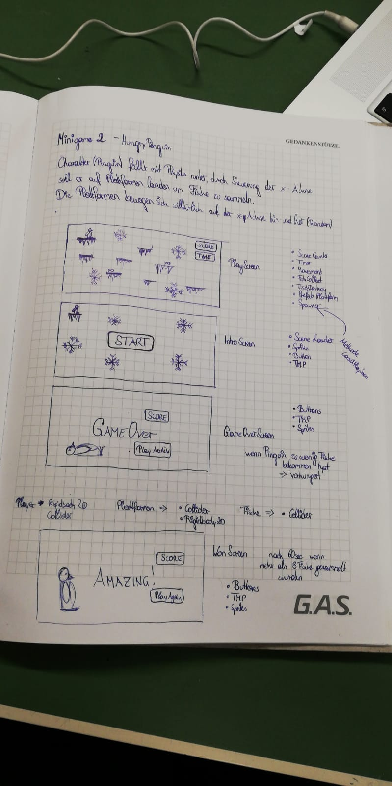

# HungryPenguin

<h2> Beschreibung</h2>

Bei  dem 2D-Game „HungryPenguin“ ist das Ziel den Pinguin zu füttern, indem man so viele Fische wie möglich sammelt. Der Pinguin kann sich nach links und rechts Bewegen und man muss versuchen ihn so zu steuern (Pfeiltasten), dass er auf einer Plattform mit einem Fisch zu landen kommt.   Jedoch sind die Plattformen kein fixes Element sondern bewegen sich mittels Spawner(Random) ebenfalls auf der x-Achse hin und her. Es gibt aber auch gewisse Plattformen die nach oben schweben, somit kommt man in der Scene wieder nach oben.
Hat man innerhalb der 60sec. weniger als 3 Fische gesammelt, verhungert der Pinguin und man hat das Game verloren. 

Progress in %:  90% finished 
 
                Konzept ist fertig 
 
                Projekt wurde auf GitHub angelegt
 
                Projekt wurde gecloned
 
                [Pp]ackages bei .gitignore geadded
 
                .DSStore bei .gitignore geadded
 
                Unity-Projekt ist angelegt
                 
                Scenes wurden angelegt
                 
                Player beweget sich in, x-Richtung durch Steuerung, y-Richtung durch Gravity
                (PlayerController-Script inspiriert von Caro)
 
                Collider von Player & Background wurden angelegt
                 
                SceneLoader funktionieren (ContactWithFloor-Script inspiriert von Clea)
 
                Timer funktioniert und zählt von 1:00 bis 0 herunter (inspiriert von smeerws)
 
                Fische kann man einsammeln und werden beim Score gezählt
 
                Icesheets werden gespawned und schweben von links nach rechts, rechts nach links
                Jene Icesheets, mit denen man wieder nach oben kommt funktionieren auch. (inspiriert von smeerws)
 
                Fische werden auf die schwebenden Icesheet gespawned. (inspiriert von smeerws)
                

Name des Minigames lautet: HungryPenguin
 
Developmentplattform: Unity Version 2018.2.14f1 
 
Visualstudio 7.7 
 
Betriebssystem: macOS Mojave 10.14.1
 
Targetplattform: Computer 16:9 mit einer Auflösung von 1920,1080px 
 
Runtime Version: .NET 3.5 Equivalent
 
API Level: .NET 2.0 Subset
 
Steuerung: Pfeiltasten
 
<h2> Limitations</h2>
Score funktioniert nicht
 
Nach 60 sec. kommt automatisch der GameOver-Screen, da der Score nicht abgefragt wird. Somit ist es unmöglich zu gewinnen. 
<h2>LessonsLearned</h2>
Wie man den Countdown anlegt, dass es von 60 runter zählt und angezeigt wird
 
Wie man den Score programmiert, dass die Fische gezählt werden und der Score angezeigt wird.
 
Das Movement vom Charakter.
  
Wie sich die Plattformen nach links und rechts bewegen.

